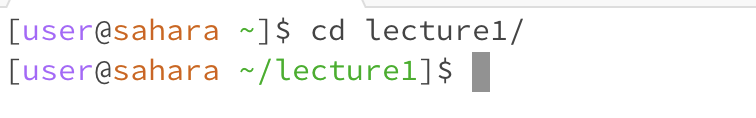
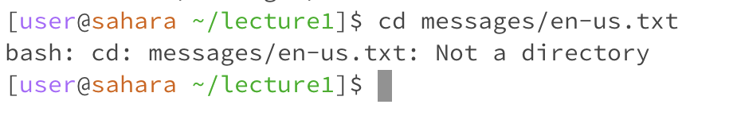
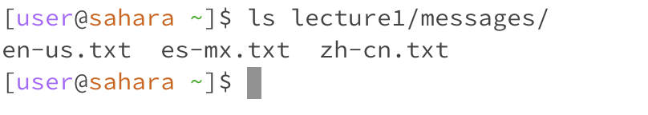
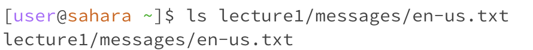
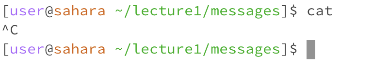
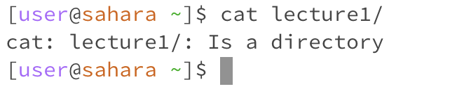
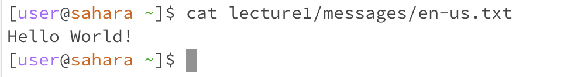

# Lab Report 1

When cd is used with no arguments, it does nothing. I got this output because cd is used to change directory to a specified directory. If there is no directory specified it cannot change the current directory. Because nothing wrong happens, no error occurs.

When cd is used with a path to a directory, it changes the directory you are in to that directory. This is the intended purpose of this command so there is no output logging any potential errors.

When cd is used with a path to a file, it returns an error: Not a directory. This is because cd is used to change directory. It doesn't make sense to change directory to a file hence the error message.

When ls is used with no arguments, it lists all the files in the current directory. This is the intended purpose of ls, all it does is list the files of a directory, and when no directory is specified, it will just print the files in the current directory. Since this is the correct use of the command, there is no error.

When ls is used with a path to a directory, it lists all the files in the directory specified. ls can also be used to print the files in a directory stated, not just the current directory. Becuase this is the inteded purpose of the command, there is no error.

When ls is used with a path to a file, it will just print the path to that file. This isn't really an error, but it is not the intended purpose of the command.

When cat is used with no arguments, the terminal stalls forever, which seems to be an error. The command has to be stopped with control c for the terminal to be used again. I got this output because cat is supposed to be used with a text file, so when there is no text file specified, it will stall.

When cat is used with a path to a directory, it will do nothing and return a message saying the directory specified is a directory. This is because cat is used to print out the text in a textfile, so it cannot be used on a directory. This is not really an error but it is not the intended use of the command.

When cat is used with a path to a file, it will print the contents of the file out. There is no error here since this is how it is supposed to be used. 

