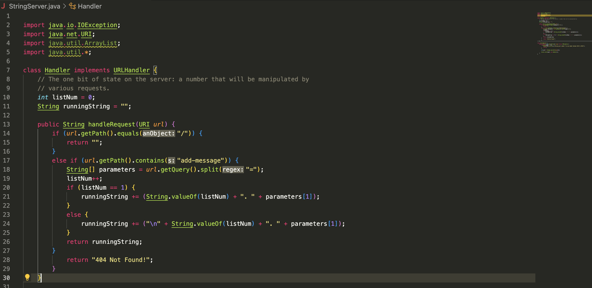
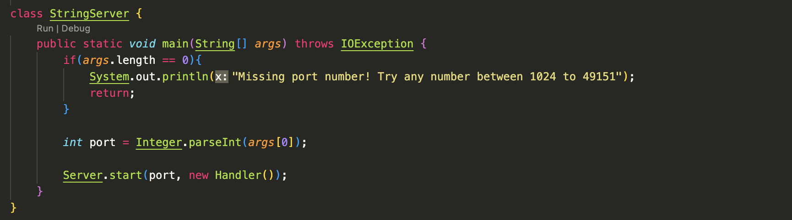
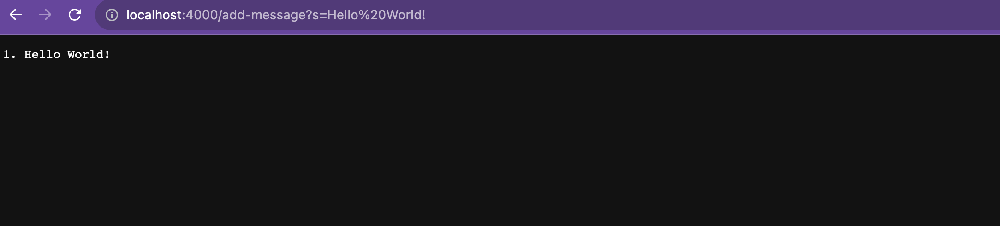
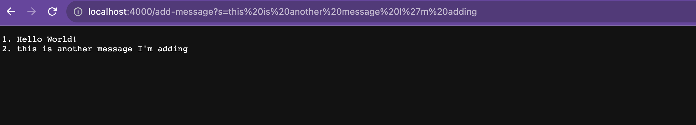

#Lab Report 2
##Part 1

###StringServer code

###/add-message

- The methods that are called are: handleRequest(URI url), url.getpath().equals(), url.getpath().contains(), url.getQuery().split(), myList.indexOf(), String.valueOf()
- The argument to handleRequest is the url passed into the program. The argument to url.getpath().equals() is an object string. The argument to url.getpath().contains() is a string object. The argument to url.getQuery().split() is a regex string, and the argument to Stiring.valueOf is the listNum, which is a field that keeps track of the list number. The value of runningString gets changed with every request to new-message since it will add a newline and the new message provided in the url.
- The value of listNum changes with every request to add-message, since it must be incremented for the messages to be numbered properly. The value of runningString also changes with this request since it must add Hello World to it so it can be retured on the page.

- The methods that are called are: handleRequest(URI url), url.getpath().equals(), url.getpath().contains(), url.getQuery().split(), myList.indexOf(), String.valueOf()
- The argument to handleRequest is the url passed into the program. The argument to url.getpath().equals() is an object string. The argument to url.getpath().contains() is a string object. The argument to url.getQuery().split() is a regex string, and the argument to Stiring.valueOf is the listNum, which is a field that keeps track of the list number. The value of runningString gets modified here with the new message from the url and a newline before it.
- The value of listNum changes with every request to add-message, since it must be incremented for the messages to be numbered properly. The value of runningString changes since a new line is added to it and the new message from the add-message request.

##Part 2

