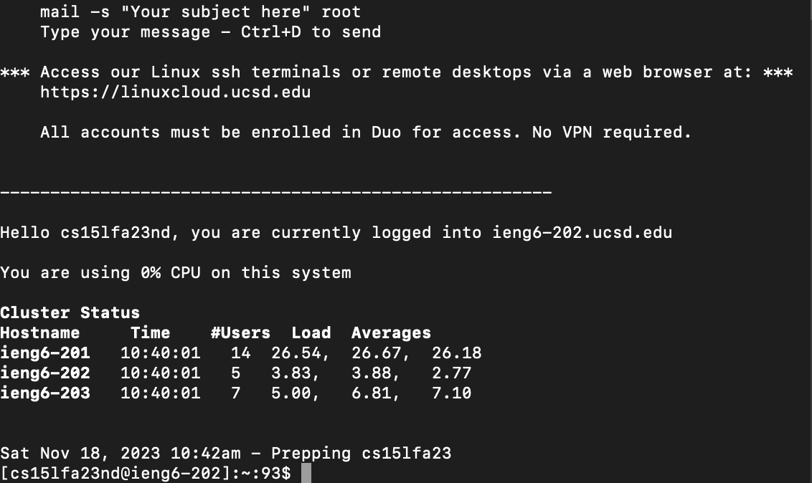
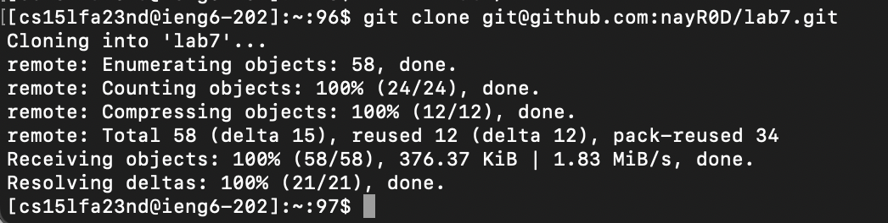
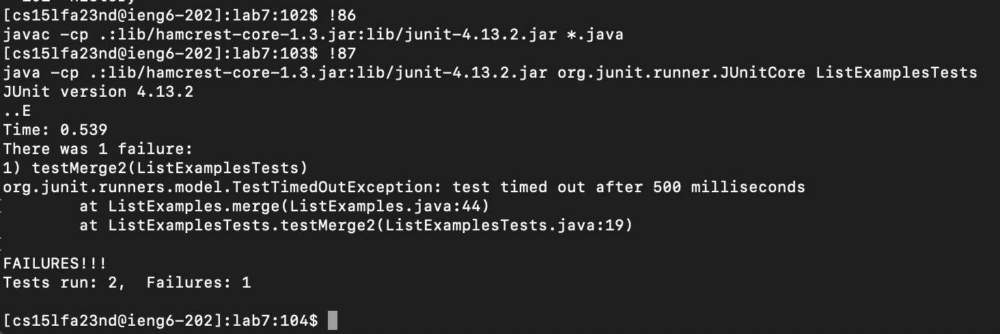
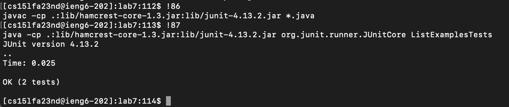
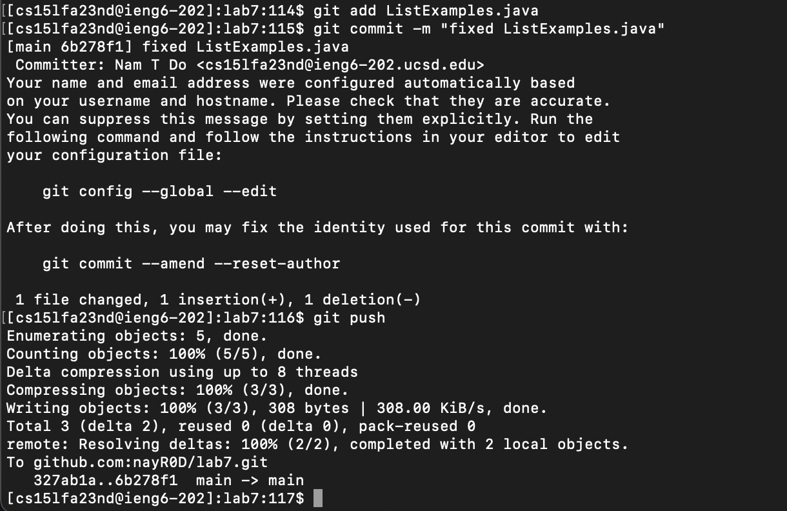

# Lab Report 4 - Vim
## Vim
### Step 4

Keys Pressed: *ssh <command + v><*enter*>* My ieng6 username (cs15lfa23nd@ieng6.ucsd.edu) was previously copied into my clipboard, so all I needed to do to log in was to ssh then paste my username. So, the full command would be: ssh cs15lfa23nd@ieng6.ucsd.edu.

### Step 5

Keys Pressed: *git clone <command + v><*enter*>*  I previously saved the SSH URL (git@github.com:nayR0D/lab7.git) of the lab7 fork to my clipboard, so all I needed to do is paste it into the terminal with git clone to clone the repo. So the full command is: git clone git@github.com:nayR0D/lab7.git

### Step 6

Keys Pressed: *cd lab7<*enter*>, history<*enter*>, !86<*enter*>, !87<*enter*>* First, I had to change directory into the repo I just copied which is lab7. Then I can open my terminal history which saves all the commands I had previoulsy ran in this terminal. The compile command, javac -cp .:lib/hamcrest-core-1.3.jar:lib/junit-4.13.2.jar *.java, was saved in my history as command 86, and the run command, java -cp .:lib/hamcrest-core-1.3.jar:lib/junit-4.13.2.jar org.junit.runner.JUnitCore ListExamplesTests, was saved in my history as command 87. By typing !86, and !87 I'm able to re-run those commands respectively. So the command run were: javac -cp .:lib/hamcrest-core-1.3.jar:lib/junit-4.13.2.jar *.java, java -cp .:lib/hamcrest-core-1.3.jar:lib/junit-4.13.2.jar org.junit.runner.JUnitCore ListExamplesTests

### Step 7

 \
Keys Pressed: *vim List<*tab*>.j<*tab*><*enter*>, </>index1<*enter*> <shift + n>, e, x, i, 2 <*esc*>, :wq* First, I had to use vim to edit the file. By typing vim and List<*tab*> it autocompleted to ListExamples, then with .j<*tab*> it autocompleted to ListExamples.java. In the vim program, I searched for the index1 I wanted to change by hitting the </> key, then typing index1<enter> to search for index1. Pressing <shift + n> searches for the last instance of index1 which is the one I wanted to change. pressing e, brings the cursor to the last character of the word which in this case is the "1" in index1. Pressing x will delete the 1, and pressing "i" will enter insert mode where I can then press 2 to insert a 2 where the 1 was. Now I just press <*esc*> to escape insert mode then type :wq to write quit the file.

### Step 8

Keys Pressed: *!86<*enter*>, !87<*enter*>* Since the compile command, javac -cp .:lib/hamcrest-core-1.3.jar:lib/junit-4.13.2.jar *.java, and the run command, java -cp .:lib/hamcrest-core-1.3.jar:lib/junit-4.13.2.jar org.junit.runner.JUnitCore ListExamplesTests, are still in the same section of the command history, I can just re-run the !86 and !87 command to run the compile and run commands. Commands Run: javac -cp .:lib/hamcrest-core-1.3.jar:lib/junit-4.13.2.jar *.java, java -cp .:lib/hamcrest-core-1.3.jar:lib/junit-4.13.2.jar org.junit.runner.JUnitCore ListExamplesTests

### Step 9

Keys Pressed: *git add List <*tab*><*enter*>, git commit -m "fixed ListExamples.java"<*enter*>, git push<*enter*>* I first had to stage the file I changed to the commit object with git add, and I autofilled the rest of the file name with <*tab*>. I then created the commit with git commit with the -m option to add a message. I then pushed the changes up to the remote repo with git push. Commands run: git add ListExamples.java, git commit -m "fixed ListExamples.java", git push
