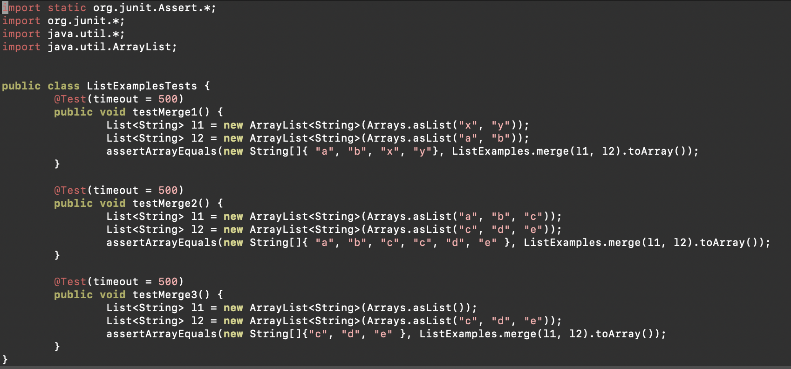

# Lab Report 5 - Putting It All Together
## Part 1 - Debugging Scenario
1.  \
Student: Hi, It seems that when there are two lists with elements in my merge function, there is TestTimedOutException. It seems that when one list is empty, and when one list is not, the function works. So it seems that when two lists have elements there is an error somewhere. 

2. TA: Hi, A TestTimedOutException usually means that there is an infinite loop somewhere in your code. Be sure to carefully check all your loops and ensure they terminate correctly.

3.  \
Student: After carefully reviewing my loops, I see what the error is. In my loops iterating over list2 in ListExamples.java, I increment the index counter for list1, not list2. therefore the condition, `while(index2 < list2.size())` never ends, resulting in an infinite loop. 

4. 
- The file & directory structure needed \
  ListExamplesFolder
  - ListExamples.java
  - ListExamplesTest.java
  - test.sh
  - lib
    - hamcrest-core-1.3.jar
    - junit-4.13.2.jar 
- The contents of each file before fixing the bug
  - ListExamples.java
    - 
  - ListExamplesTest.java
    - 
  - test.sh
    - 
  - hamcrest-core-1.3.jar
    - 
  - junit-4.13.2.jar
    -  
- The full command line (or lines) you ran to trigger the bug
  - `bash test.sh` 
- A description of what to edit to fix the bug
  - To fix the bug, you must vim into ListExamples.java and edit that line that increments index1 in the `while(index2 < list2.size())` loop. You must change index1 to index2.
 
## Part 2 - Reflection
I learned a lot more useful vim commands that I did not know before. I have used vim before, but there are so many useful commands that I learned that save me a lot more time now like the x command. I also learned a lot more about bash scripting which is useful. I learned how to do conditional statements in bash which is useful for creating more robust bash scripts.
